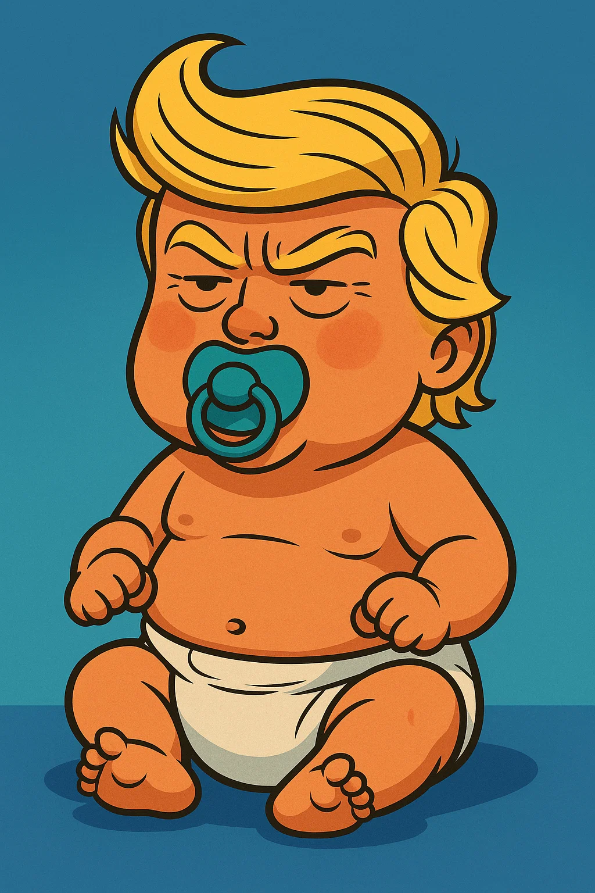

# Trumpagochi

Trumpagochi is a quirky virtual pet game where you take care of and guide the evolution of a character inspired by Donald Trump. Keep his stats balanced and make strategic decisions to see him evolve from an egg to potentially becoming a GOD!

You can immediately play the game at: [Trumpagochi](http://www.trumpagochi.infy.uk/)

## How to Play

1.  Open the `index.html` file in your web browser or go to: [Trumpagochi](http://www.trumpagochi.infy.uk/).
2.  Click the "Start Game" button to hatch your Trumpagochi egg.
3.  Monitor the stats displayed on the right side of the screen:
    * **Ego:** Represents his self-esteem and confidence.
    * **Approval:** Represents public opinion or popularity.
    * **Wealth ($):** Represents his financial status.
    * **International Relations:** Represents his standing with other countries.
    * **Tax Confidence:** Represents the likelihood of facing tax issues (higher is better).
4.  Click on the action buttons (`Impose Tariffs`, `Tweet Storm`, `Hold Rally`, etc.) to perform actions. Each action will affect different stats. Pay attention to the message log for feedback on the outcome of your actions.
5.  Watch your Trumpagochi evolve as his age increases and stats change!

## Evolution Stages

Your Trumpagochi will evolve through different stages based on his age and possibly his stats:

* Egg
* Newborn
* Boy
* Adult
* Old
* GOD

Help the Newborn to get up to GOD stages:

### Newborn Trumpagochi

### GOD Trumpagochi

There are also potential final stages based on game over conditions:

* Retire in the Tower (if he fails but isn't arrested)
* ARRESTED (if Tax Confidence drops too low after a certain age)

## Game Over Conditions

The game ends if any of the following stats drop to 0 (or below 0 for Wealth):

* Ego
* Approval
* Wealth (Bankruptcy)
* International Relations
* Tax Confidence (after a certain age, leads to arrest)

The game is also won if you reach the 'GOD' stage by achieving a high enough age.

## Actions

Choose your actions wisely, as they have different effects on your Trumpagochi's stats:

* **Impose Tariffs:** Increases Ego and Wealth, decreases International Relations.
* **Tweet Storm:** Primarily increases Ego, with a probabilistic effect on Approval (can increase or decrease) and a small decrease in Wealth.
* **Hold Rally:** Probabilistically affects Approval (can increase significantly or decrease slightly), increases Ego, and decreases Wealth.
* **Play Golf:** Increases Ego and International Relations, decreases Wealth.
* **Criticize Media:** Probabilistically affects Ego and Approval (can increase or decrease), and decreases Wealth.
* **Build Buildings:** Costs Wealth, with a probabilistic outcome that can significantly increase Wealth, Ego, and Approval, but also increases Tax Suspicion (decreases Tax Confidence). A failed project leads to a loss of Wealth, Ego, and Approval.
* **Invest in Crypto:** Costs Wealth, with a probabilistic outcome ranging from significant Wealth gain to significant loss, affecting Ego based on the outcome and potentially increasing Tax Suspicion (decreasing Tax Confidence) on successful outcomes.
* **Pay Taxes:** Decreases Wealth, but significantly increases Tax Confidence and slightly increases Approval.

Try to find the right balance to keep your Trumpagochi happy and healthy!